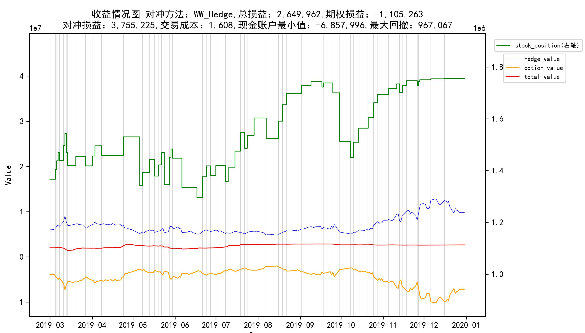
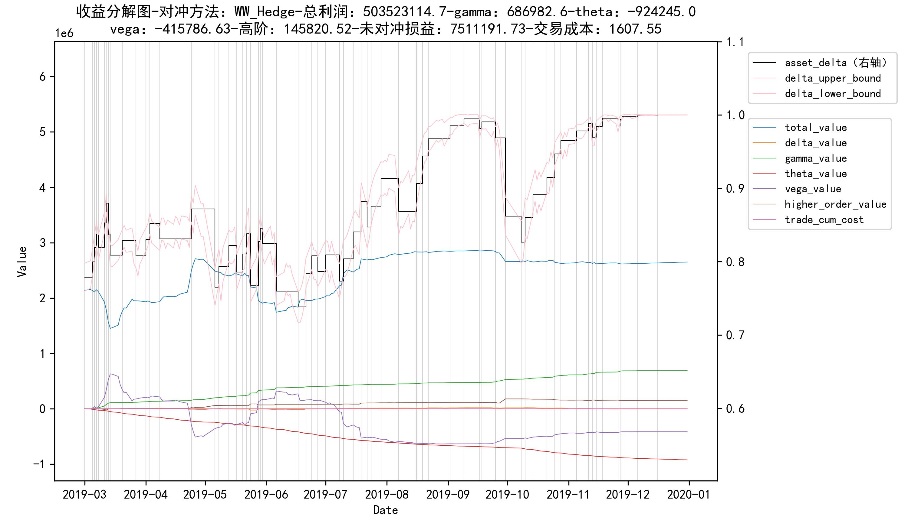

# Backtest 使用方法

## 1. 参数

### 1.1 期权参数

```python
paras = {
    'option_type': 'VanillaCall',
    'notional': 12e6,
    'start_date': '20190129',
    'end_date': '20191231',
    'K': 5.42,
    'stock_code': '300277.SZ',
    'start_price': 6.19
}
```

### 1.2 对冲策略

```python
'Zakamouline'或'WW_Hedge'
```

## 2.使用方法

```python
backtest = Backtest() #实例化Backtest对象
backtest.set_paras_by_dict(paras) #传入期权参数
backtest.set_strategy('Zakamouline') #传入策略参数
backtest.run_backtest() #开始回测
```

## 3.回测结果

### 3.1 收益情况图



### 3.2 收益分解图



